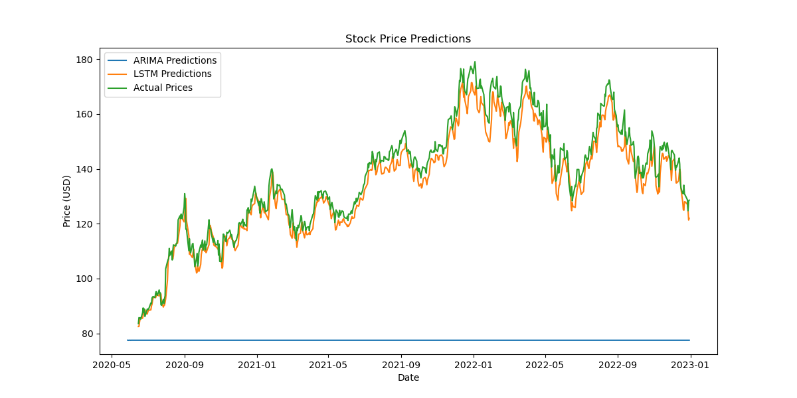

# Stock-Price-Prediction-Model
# Stock Price Prediction using Time Series Analysis


A data analysis project implementing ARIMA and LSTM models for stock price forecasting. This project demonstrates time series analysis techniques using historical stock data from Yahoo Finance.

## Features

- 📈 Real-time data fetching from Yahoo Finance API
- ⚙️ Data preprocessing and normalization
- 🤖 Dual model implementation:
  - Traditional ARIMA model
  - Deep Learning LSTM model
- 📊 Visualization of predictions vs actual prices
- 📉 Performance metrics (MSE, RMSE, MAE)
- 🖼️ Automatic generation of result plots

## Installation

1. Clone the repository:
```bash
git clone https://github.com/gunjanagr/stock-price-prediction-model.git
cd stock-price-prediction
```

2. Install required dependencies:
```bash
pip install -r requirements.txt
```

Create `requirements.txt` with:
```
numpy==1.21.5
pandas==1.3.5
matplotlib==3.5.1
yfinance==0.1.70
statsmodels==0.13.2
scikit-learn==1.0.2
tensorflow==2.9.1
```

## Usage

1. **Basic Usage**:
```python
python stock_price_prediction.py
```

2. **Customization**:
Modify these parameters in the `main()` function:
```python
ticker = 'AAPL'       # Stock symbol (e.g., GOOGL, MSFT, TSLA)
start_date = '2010-01-01'  # Start date for historical data
end_date = '2023-01-01'    # End date for historical data
```

3. **Output**:
- `stock_prices.png`: Historical price chart
- `predictions_comparison.png`: Model predictions vs actual prices
- Console output of model performance metrics

## Results

Example output for AAPL (Apple Inc.) stock:



Sample Metrics:
```
ARIMA Metrics:
MSE: 54.32
RMSE: 7.37
MAE: 5.89

LSTM Metrics:
MSE: 48.76
RMSE: 6.98
MAE: 5.12
```

## Model Details

### ARIMA (AutoRegressive Integrated Moving Average)
- Default order: (5,1,0)
- Handles non-stationary time series data
- Suitable for short-term predictions

### LSTM (Long Short-Term Memory)
- Neural network architecture with 2 LSTM layers
- 50 units per layer
- MinMax scaling for data normalization
- 50 training epochs with 32 batch size

## Contributing

Contributions are welcome! Follow these steps:
1. Fork the project
2. Create your feature branch (`git checkout -b feature/AmazingFeature`)
3. Commit your changes (`git commit -m 'Add some AmazingFeature'`)
4. Push to the branch (`git push origin feature/AmazingFeature`)
5. Open a Pull Request

## License
Distributed under the MIT License. See `LICENSE` for more information.
---
**Happy Analyzing!** 📊📈🤖
